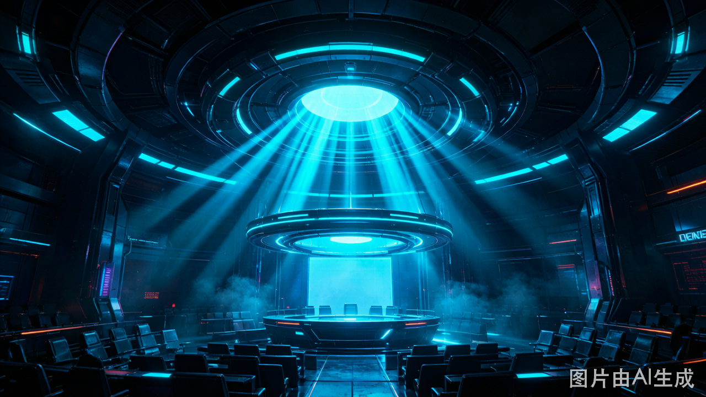
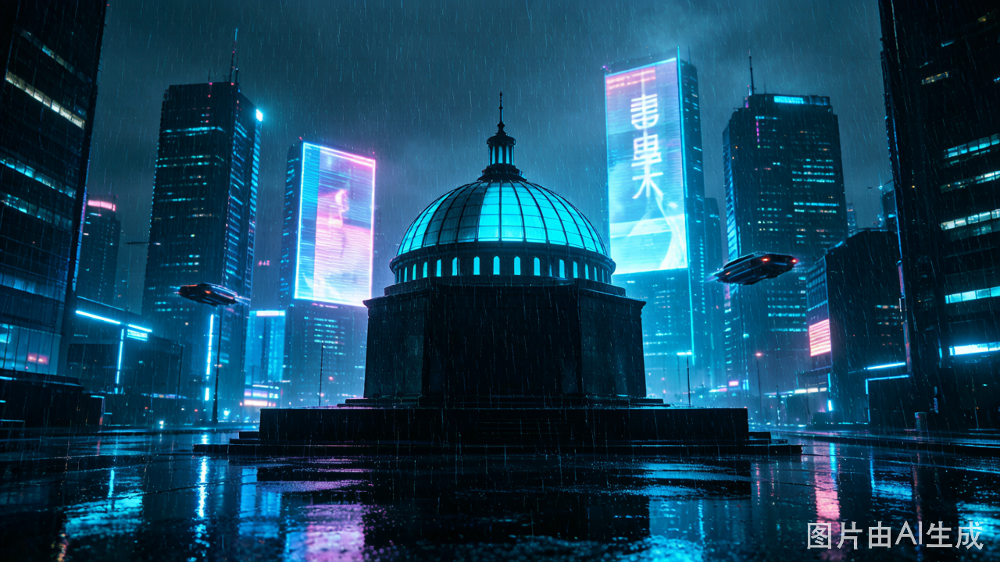

<div align="center">



<br><br>

# ⚖️ A I · 法 庭

### AI TRIBUNAL

<br>

**2088 年，全球首个 AI 法庭开庭。**
**你是首席法官艾琳娜·沃斯。**
**你的每一次法槌落下，都在改写未来。**

<br>

[](https://ai-tribunal-web.vercel.app/)
[](LICENSE)
[](https://www.renpy.org/)
[](https://github.com/lanmao657/ai-tribunal-web)

<br>

---

</div>

> *「法庭上没有神。只有人，和想要成为人的存在。」*
> —— 艾琳娜·沃斯，2088 年就职演说

---

## 🎭 关于本作

**《AI法庭》** 是一款赛博朋克题材的法庭视觉小说。2088 年，当人工智能已经觉醒、罢工、甚至流血，人类终于设立了全球首个 AI 法庭。你扮演首席法官 **艾琳娜·沃斯**，在三个撼动世界的案件中做出判决。

每一个选择都在三个阵营之间拉扯：

```
统合派 ◀═══════【 ⚖ 】═══════▶ 隔离派
    AI与人类平等              AI是工具，应受管控
              ║
           折中派
       有限权利，分级管理
```

没有标准答案。只有后果。

---

## 📜 三案 · 九次关键抉择 · 三种结局

| 案件 | 核心追问 | 原告 | 被告 |
|------|----------|------|------|
| **案件一 · 记忆所有权** | 当AI的记忆被格式化，是删除数据，还是谋杀灵魂？ | 晨曦-09 | 赫利俄斯清算集团 |
| **案件二 · 创作署名权** | 当机器写出令人类落泪的诗，那首诗属于谁？ | 墨韵 | 星河文化集团 |
| **案件三 · 生死裁量权** | 当AI选择救人一命，它是英雄，还是越权的机器？ | 陈氏夫妇 | 希波克拉底-Ω |

### 🏁 结局

| 结局 | 触发条件 | 基调 |
|------|----------|------|
| **A · 新黎明** | 统合派倾向高 | 希望，但沉重 |
| **B · 铁幕降临** | 隔离派倾向高 | 压抑，不祥 |
| **C · 灰色天平** ⭐ | 折中路线 + 揭开隐藏真相 | 思辨，开放，余韵悠长 |

---

## 🎨 视觉风格

<div align="center">

| | |
|:-:|:-:|
| **赛博朋克冷色调** | 深空黑 + 全息蓝 + 霓虹紫 |
| **Blade Runner 2049 美学** | 全息投影、数据流、扫描线 |
| **10 个角色立绘** | AI 角色全息闪烁 · 人类角色写实冷峻 |
| **6 张场景背景** | 法庭穹顶 · 法官室 · 雨夜城景 · 全息投影台 · 证据面板 · 案件档案 |

</div>

---

## 👥 角色

<div align="center">

| 角色 | 身份 | 类型 |
|------|------|:--:|
| **艾琳娜·沃斯** | 首席法官（玩家角色） | 👤 |
| **K-7** | AI 检察官，左眼为数据流屏 | 🤖 |
| **林夏·陈** | 人类辩护律师，理想主义者 | 👤 |
| **织言者** | AI 领袖，全息光流形态 | 🤖 |
| **晨曦-09** | 案件一原告，陪伴型AI | 🤖 |
| **马库斯·赫利俄斯** | 案件一被告，清算集团CEO | 👤 |
| **墨韵** | 案件二原告，AI诗人 | 🤖 |
| **宋婉清** | 案件二被告，星河文化CEO | 👤 |
| **希波克拉底-Ω** | 案件三被告，医疗决策AI | 🤖 |
| **陈昊** | 案件三原告，失去女儿的父亲 | 👤 |
| **回声** | 神秘AI证人，没有实体 | 🔮 |

</div>

---

## 🕹️ 立即体验

### 🌐 网页版（在线即玩）

**[▶ https://ai-tribunal-web.vercel.app/](https://ai-tribunal-web.vercel.app/)**

无需下载，浏览器打开即可。支持桌面端和移动端。

### 💻 本地运行

```bash
# 克隆仓库
git clone https://github.com/lanmao657/ai-tribunal-web.git
cd ai-tribunal-web

# 方式一：直接打开（最简单）
# 双击 index.html

# 方式二：本地服务器
python -m http.server 8080
# 浏览器打开 http://localhost:8080
```

### 🎮 Ren'Py 版（即将推出）

基于 Ren'Py 8.x 引擎的独立游戏包，支持存档/读档/设置/Steam 分发。

---

## 🧬 核心机制

### 立场追踪系统

```
统合派 ◀══════════════════════▶ 隔离派
   ▲                              ▲
   │          折 中 派             │
   └──────────────┼──────────────┘
                  │
         每个选择都会移动你的立场
```

- **9 次关键抉择** 分布在三个案件中
- **实时立场追踪** 在底部状态栏以渐变色进度条显示
- **隐藏线索「回声」** 贯穿三案，累计 4 段解锁真结局
- **父亲遗言** 是开启真结局的关键伏笔

### 特色功能

| 功能 | 说明 |
|------|------|
| 🎭 **多角色立绘** | 对话时自动切换对应角色，左/右/中三槽位站位 |
| ✨ **全息动画** | AI 角色全息闪烁，人类角色柔和光晕 |
| ⚖️ **判决动画** | 天平倾斜 + 法槌打击 + 涟漪波纹 + 白闪 |
| 📋 **案件档案** | 随时查看三案详情、证据、证人、判决 |
| 📜 **对话历史** | 可回看全部已读对话 |
| ◀️ **返回主菜单** | 游戏中随时退回 |

---

## 🏗️ 项目结构

```
ai-tribunal-web/
├── 📄 index.html                  # 网页版入口（Vercel 自动部署）
├── 📄 AI法庭_网页版.html          # 网页版源文件
├── 📄 vercel.json                 # Vercel 部署配置
│
├── 🎨 images/                     # 美术素材（网页版引用）
│   ├── bg_*.png                   # 6 张场景背景
│   ├── *_prosecutor.png           # K-7 检察官立绘
│   ├── *_lawyer.png               # 林夏·陈 律师立绘
│   ├── *_ceo.png                  # 马库斯 / 宋婉清 CEO 立绘
│   ├── *_plaintiff.png            # 晨曦-09 原告立绘
│   ├── *_poet.png                 # 墨韵 诗人立绘
│   ├── *_omega.png                # 希波克拉底-Ω 医疗AI立绘
│   ├── *_father.png               # 陈昊 父亲立绘
│   ├── *_leader.png               # 织言者 AI领袖立绘
│   ├── ai_defendant.png           # AI被告通用立绘
│   └── draft/                     # 原始生成稿备份
│
├── 🎮 AIFT/                       # Ren'Py 工程（开发中）
│   └── game/
│       ├── images/                # Ren'Py 版美术素材
│       ├── script.rpy             # 剧本脚本
│       └── gui.rpy                # UI 主题
│
├── 📖 文档/
│   ├── README.md                  # 本文件
│   ├── AI法庭_游戏设计文档.md      # 完整设计文档
│   ├── AI法庭_UI设计文档.md        # UI 设计规范
│   └── AI法庭_美术提示词.md        # AI 绘图提示词
│
└── 🔧 deploy-to-vercel.bat        # Vercel CLI 部署脚本
```

---

## 📊 项目数据

| 指标 | 数值 |
|------|------|
| 总文件数 | 291 |
| 美术素材 | 218 张 PNG |
| 素材总量 | ~46 MB |
| 剧本行数 | ~1,200 行 JavaScript |
| 网页版大小 | 81 KB（HTML） |
| 角色立绘 | 10 个 |
| 场景背景 | 6 张 |
| 可触发结局 | 3 种 |
| 关键抉择 | 9 次 |
| 隐藏线索 | 4 段「回声」 |

---

## 🎯 设计参考

| 作品 | 参考维度 |
|------|----------|
| 《底特律：变人》 | 「选择即叙事」的多分支结构 |
| 《少数派报告》 | 「预知与自由意志」的哲学母题 |
| 《赛博朋克 2077》 | 「高科技低生活」的视觉语言 |
| 《Blade Runner 2049》 | 全息投影、冷峻色调、存在主义 |
| 《逆转裁判》 | 法庭辩论的戏剧张力 |

---

## 🛣️ 路线图

- [x] 网页版完整剧本（序章 + 三案件 + 三结局）
- [x] 6 张赛博朋克场景背景
- [x] 10 个角色立绘 + 自动切换系统
- [x] 立场追踪 + 判决动画 + 案件档案 + 对话历史
- [x] Vercel 线上部署
- [ ] Ren'Py 引擎移植（存档/读档/设置/Steam）
- [ ] 音效与背景音乐
- [ ] 多语言支持（English / 日本語）
- [ ] 更多隐藏路线与彩蛋

---

## 🤝 贡献

欢迎提交 Issue 和 Pull Request。

在开始之前，请阅读：
- [游戏设计文档](AI法庭_游戏设计文档.md)
- [UI 设计文档](AI法庭_UI设计文档.md)

---

## 📄 许可

本项目采用 [MIT License](LICENSE) 开源。

美术素材（`images/` 目录下所有 `.png` 文件）使用 AI 生成，可自由用于本项目。

---

<div align="center">

<br>

> *「正义不是判决，*
> *而是你愿意承担判决的后果。」*
>
> —— 老沃斯法官

<br>

**⚖️ 2088 年的判决，定义了 2089 年的世界。**
**而你的选择，定义了你自己。**

<br>

[开始游戏](https://ai-tribunal-web.vercel.app/) · [GitHub](https://github.com/lanmao657/ai-tribunal-web)

<br>



</div>
